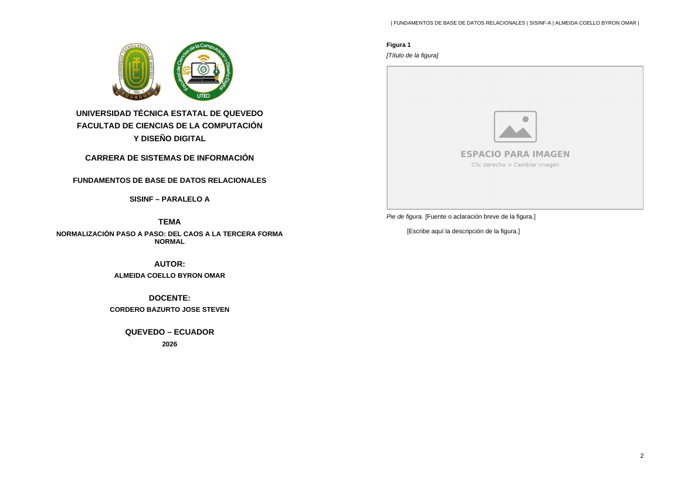

# Generador de portada académica (.docx)

Programa en Java (Swing) que genera un documento de Word en formato A4 con la portada de la
Universidad Técnica Estatal de Quevedo, encabezado, numeración de páginas y hojas con espacios
para figuras. No usa librerías externas: el `.docx` se arma directamente con `java.util.zip`.



## Qué hace

1. Muestra una ventana que pide **materia**, **tema**, **autor o grupo**, **profesor**, el nombre
   que irá en las propiedades del archivo y la cantidad de hojas de figuras.
2. Genera un `.docx` A4 (Arial 11, interlineado 1,5, márgenes de 2,54 cm) con:
   - Portada con logos de universidad y facultad (sin encabezado ni pie).
   - Encabezado: `| MATERIA | SISINF-A | AUTOR O GRUPO |`.
   - Pie de página con el número de página.
   - Hojas de figura con título, espacio para la imagen, pie y descripción.
3. Guarda el autor en las propiedades del archivo (Detalles > Autores).

## Requisitos

- Java 8 o superior.

## Cómo ejecutarlo

### Desde un JAR (Releases)

Descarga `GeneradorPortada.jar` desde la sección **Releases** y haz doble clic, o ejecuta:

```bash
java -jar GeneradorPortada.jar
```

### Desde el código

1. Copia `logo_universidad.png` y `logo_facultad.png` junto a `GeneradorPortada.java`
   (dentro de `src/`). Los logos no se incluyen en este repositorio.
2. Compila y ejecuta:

```bash
cd src
javac GeneradorPortada.java
java GeneradorPortada
```

En IntelliJ: abre la carpeta como proyecto, marca `src` como *Sources Root* y ejecuta `main`.

### Crear el JAR

```bash
cd src
javac --release 8 GeneradorPortada.java
printf 'Main-Class: GeneradorPortada\n' > manifest.txt
jar cfm GeneradorPortada.jar manifest.txt *.class *.png
```

## Personalización

Los datos fijos de la portada (universidad, facultad, carrera, paralelo, lugar) están como
constantes al inicio de `GeneradorPortada.java`.

## Licencia

MIT. Los logos pertenecen a la Universidad Técnica Estatal de Quevedo y a su facultad.
