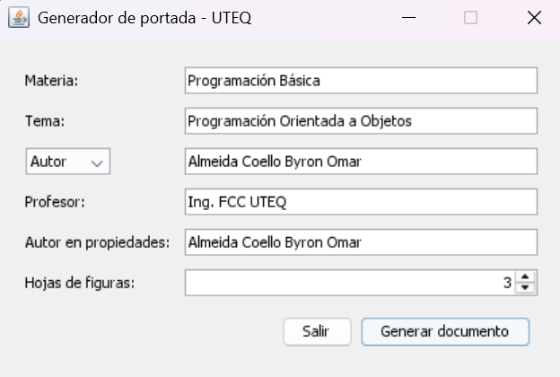

<div align="center">

# 📄 Generador de portada académica

**Crea en segundos un documento Word (.docx) en formato A4 con portada, encabezado, numeración de páginas y hojas listas para tus figuras.**


</div>

---

## Tabla de contenido

- [Características](#características)
- [Inicio rápido](#inicio-rápido)
- [Uso](#uso)
- [Estructura del documento generado](#estructura-del-documento-generado)
- [Logos](#logos)
- [Compilar desde el código](#compilar-desde-el-código)
- [Cómo funciona](#cómo-funciona)
- [Personalización](#personalización)
- [Autor y licencia](#autor-y-licencia)

## Características

- ✅ Interfaz gráfica sencilla (Java Swing), sin necesidad de abrir Word.
- ✅ Documento **A4**, Arial 11, interlineado 1,5 y márgenes de 2,54 cm.
- ✅ Portada con datos de la materia, tema, autor o grupo y docente.
- ✅ **Encabezado** con materia, paralelo y autor, y **pie de página** con número.
- ✅ Hojas de figura con título, espacio para la imagen, pie y descripción.
- ✅ Autor guardado en las propiedades del archivo (*Detalles > Autores*).
- ✅ **Cero dependencias:** el `.docx` se construye con `java.util.zip`.
- ✅ Compatible con Java 8 o superior.

## Inicio rápido

1. Instala [Java 8 o superior](https://adoptium.net/).
2. Descarga `GeneradorPortada.jar` desde la sección **[Releases](../../releases)**.
3. Haz doble clic en el archivo, o ejecútalo desde la terminal:

```bash
java -jar GeneradorPortada.jar
```

## Uso

Completa la ventana y pulsa **Generar documento**:


| Campo | Descripción |
|---|---|
| Materia | Nombre de la asignatura. |
| Tema | Título del trabajo. También se usa como título del archivo. |
| Autor / Autores / Grupo | Quién presenta el trabajo (se elige el tipo en la lista). |
| Profesor | Nombre del docente. |
| Autor en propiedades | Nombre que aparece en *Detalles > Autores*. Si queda vacío se usa el autor o grupo. Se recuerda para la próxima vez. |
| Hojas de figuras | Cantidad de hojas con espacio para imagen (0 a 50). |

Después elige dónde guardar el archivo y el programa te ofrece abrirlo.

## Estructura del documento generado

| Página | Contenido |
|---|---|
| 1 | Portada: universidad, facultad, carrera, materia, paralelo, tema, autor, docente, lugar y año. Sin encabezado ni pie. |
| 2 en adelante | Hojas de figura: *Figura N*, título, espacio para la imagen, pie de figura y descripción. |

En todas las páginas (excepto la portada):

- **Encabezado:** `| MATERIA | SISINF-A | AUTOR O GRUPO |`
- **Pie de página:** número de página a la derecha.

> Para reemplazar el espacio gris por tu imagen en Word: clic derecho > **Cambiar imagen**. Se conserva el tamaño.

## Logos

Los logos institucionales **no se incluyen** en este repositorio.

Para que aparezcan en la portada, coloca estos archivos en la misma carpeta desde donde ejecutas el programa (o dentro de `src/` si lo ejecutas desde el IDE):

- `logo_universidad.png`
- `logo_facultad.png`

Si no están, el documento se genera igual, sin logos, y el programa muestra un aviso.

## Compilar desde el código

```bash
cd src
javac GeneradorPortada.java
java GeneradorPortada
```

En **IntelliJ IDEA**: abre la carpeta del repositorio, marca `src` como *Sources Root* y ejecuta el método `main` de `GeneradorPortada`.

Para crear tu propio JAR:

```bash
cd src
javac --release 8 GeneradorPortada.java
printf 'Main-Class: GeneradorPortada\n' > manifest.txt
jar cfm GeneradorPortada.jar manifest.txt *.class
```

## Cómo funciona

Un archivo `.docx` es un ZIP con archivos XML. El programa:

1. Construye `document.xml`, `header1.xml`, `footer1.xml`, `styles.xml` y las propiedades del documento como texto.
2. Genera con `java.awt` la imagen gris de relleno de las figuras.
3. Empaqueta todo con `ZipOutputStream` en un `.docx` válido que abren Word y LibreOffice.

Todo el código está en una sola clase: [`src/GeneradorPortada.java`](src/GeneradorPortada.java).

## Personalización

Los datos fijos de la portada (universidad, facultad, carrera, paralelo, lugar) están como constantes al inicio de `GeneradorPortada.java`. Cámbialos para adaptar el documento a otra carrera o institución.

## Autor y licencia

Desarrollado por **Byron Omar Almeida Coello** · [@balmeidac](https://github.com/balmeidac)

Código bajo licencia [MIT](LICENSE). Los logos institucionales pertenecen a la Universidad Técnica Estatal de Quevedo y a su facultad, y no están cubiertos por esta licencia.
